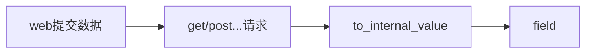
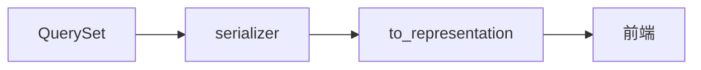

# rest_framework

[TOC]

## 简介

 Django REST框架是一个功能强大且灵活的工具包，用于构建Web API。

官方网站：[https://www.django-rest-framework.org](https://www.django-rest-framework.org/)

## 安装与加载

```
pip install djangorestframework
```

```
INSTALLED_APPS = [
		...,
    'rest_framework'
]
```

## 序列化与反序列化流程

### 反序列化流程

反序列化流程 是从前端提交数据到数据库的流程。



### 序列化流程

序列化是将数据从数据库提交到前端的过程。



## 序列化模型

创建 serializers.py文件

```
from rest_framework import serializers
from .models import Idc


class IdcSerializer(serializers.Serializer):
    """
    Idc 序列化类
    """
    id = serializers.IntegerField(read_only=True)
    name = serializers.CharField(required=True, max_length=32)
    address = serializers.CharField(required=True, max_length=256)
    phone = serializers.CharField(required=True, max_length=15)
    email = serializers.EmailField(required=True, max_length=50)
    letter = serializers.CharField(required=True, max_length=5)

    ### 定义create 与update 为反序列化准备
    def create(self, validated_data):
        return Idc.objects.create(**validated_data)

    def update(self, instance, validated_data):
        instance.name = validated_data.get("name", instance.name)
        instance.address = validated_data.get("address", instance.name)
        instance.phone = validated_data.get("phone", instance.name)
        instance.email = validated_data.get("email", instance.name)
        instance.save()
        return instance
```
## 序列与反序列化方法
```
from django.utils.six import BytesIO
from rest_framework.parsers import JSONParser
from rest_framework.renderers import JSONRenderer

## 序列化
queryset = Idc.objects.all()
serializer = IdcSerializer(queryset, many=True)
ret = JSONRenderer().render(serializer)

## 反序列化
## content 前端传入的byte 型字符串

stream = BytesIO(content)
data = JSONParser().parse(stream)

serialize1 = IdcSerializer(data=data)
# 验证数据合法性
serialize1.is_valid()
# 保存数据
serialize1.save()
# 获取合法数据
serialize1.validated_data
```

## view 逻辑实现
```
from .models import Idc
from rest_framework.decorators import api_view
from rest_framework import status
from rest_framework.response import Response
from .serializers import IdcSerializer

# ################ 版本2 ################
# 使用api_view 限制请求方式, 使用Response 简化序列化流程

@api_view(["GET", "POST"])
def idc_list(request, *args, **kwargs):
    if request.method == "GET":
        print(request.path)
        queryset = Idc.objects.all()
        serializer = IdcSerializer(queryset, many=True)
        return Response(serializer.data)
    if request.method == "POST":
        serializer = IdcSerializer(data=request.data)
        if serializer.is_valid():
            serializer.save()
            return Response(status=status.HTTP_201_CREATED)
        return Response(status=status.HTTP_400_BAD_REQUEST)

@api_view(["GET", "PUT"])
def idc_detail(request, pk, *args, **kwargs):
    try:
        queryset = Idc.objects.get(pk=pk)
    except:
        return Response(status=status.HTTP_404_NOT_FOUND)

    if request.method == "GET":
        serializer = IdcSerializer(queryset)
        return Response(serializer.data)
    if request.method == "PUT":
        serializer = IdcSerializer(queryset, data=request.data)

        if serializer.is_valid():
            serializer.save()
            return Response(status=status.HTTP_202_ACCEPTED)
        return Response(status=status.HTTP_400_BAD_REQUEST)

# ################ 版本3 ################
# 使用类视图进行改写

from rest_framework.views import APIView
from django.http import Http404


class IdcList(APIView):
    def get(self, request, format=None):
        queryset = Idc.objects.all()
        serializer = IdcSerializer(queryset, many=True)
        return Response(serializer.data)

    def post(self, request, format=None):
        serializer = IdcSerializer(data=request.data)
        if serializer.is_valid():
            serializer.save()
            return Response(serializer.data, status=status.HTTP_201_CREATED)
        return Response(serializer.data, status=status.HTTP_400_BAD_REQUEST)

class IdcDetail(APIView):

    def get_obj(self, pk):
        try:
            Idc_obj = Idc.objects.get(pk=pk)
            return Idc_obj
        except Idc.DoesNotExist:
            raise Http404

    def get(self, request, pk, format=None):
        queryset = self.get_obj(pk)
        serializer = IdcSerializer(queryset)
        return Response(serializer.data)

    def post(self, request, pk, format=None):

        queryset = self.get_obj(pk)
        serializer = IdcSerializer(queryset, data=request.data)

        if serializer.is_valid():
            serializer.save()
            return Response(status=status.HTTP_202_ACCEPTED)
        return Response(status=status.HTTP_400_BAD_REQUEST)

    def delete(self, request, pk, format=None):
        queryset = self.get_obj(pk)
        queryset.delete()
        return Response(status.HTTP_204_NO_CONTENT)

# ################ 版本6 ################
# 使用混合, 将所有请求方法定义在一个视图下

from rest_framework import viewsets


class IdcListV6(viewsets.GenericViewSet,
                mixins.RetrieveModelMixin,
                mixins.UpdateModelMixin,
                mixins.DestroyModelMixin,
                mixins.ListModelMixin,
                mixins.CreateModelMixin
                ):
    queryset = Idc.objects.all()
    serializer_class = IdcSerializer


# ################ 版本7 ################
# 简化继承关系

from rest_framework import viewsets


class IdcViewSetV7(viewsets.ModelViewSet):
    queryset = Idc.objects.all()
    serializer_class = IdcSerializer
from rest_framework.routers import DefaultRouter
```
## 注册接口
```
from rest_framework.routers import DefaultRouter
route = DefaultRouter()
route.register("idcs", views.IdcViewSetV7)
urlpatterns = [
    url(r'^', include(route.urls))
]
```


## 配置接口文档
### 在view中编写功能说明文档
```
class CabinetViewSet(viewsets.ModelViewSet):
    """
    retrieve:
        返回指定Idc 信息
    list:
        返回Idc 列表
    update:
        更新 Idc 信息
    destroy:
        删除 Idc 资源
    create:
        创建 Idc 资源
    partial_update:
        局部更新 Idc 信息
    """

    queryset = Cabinet.objects.all()
    serializer_class = CabinetSerializer
```
### 在序列化模型中添加说明信息
```
class IdcSerializer(serializers.Serializer):
    """
    Idc 序列化类
    """

    id = serializers.IntegerField(read_only=True)
    name = serializers.CharField(required=True, max_length=32, label="机房名称",  help_text="机房名称")
    address = serializers.CharField(required=True, max_length=256, label="机房地址",  help_text="机房地址")
    phone = serializers.CharField(required=True, max_length=15, label="电话号码",  help_text="电话号码")
    email = serializers.EmailField(required=True, max_length=50, label="邮箱",  help_text="邮箱")
    letter = serializers.CharField(required=True, max_length=5, label="机房缩写", help_text="机房缩写")

    def create(self, validated_data):
        return Idc.objects.create(**validated_data)

    def update(self, instance, validated_data):
        instance.name = validated_data.get("name", instance.name)
        instance.address = validated_data.get("address", instance.name)
        instance.phone = validated_data.get("phone", instance.name)
        instance.email = validated_data.get("email", instance.name)
        instance.save()
        return instance
```
### 注册文档接口
```
from rest_framework.documentation import include_docs_urls

urlpatterns = [
    ...,
    url('^docs', include_docs_urls("运维平台接口文档")),
    ...
]
```